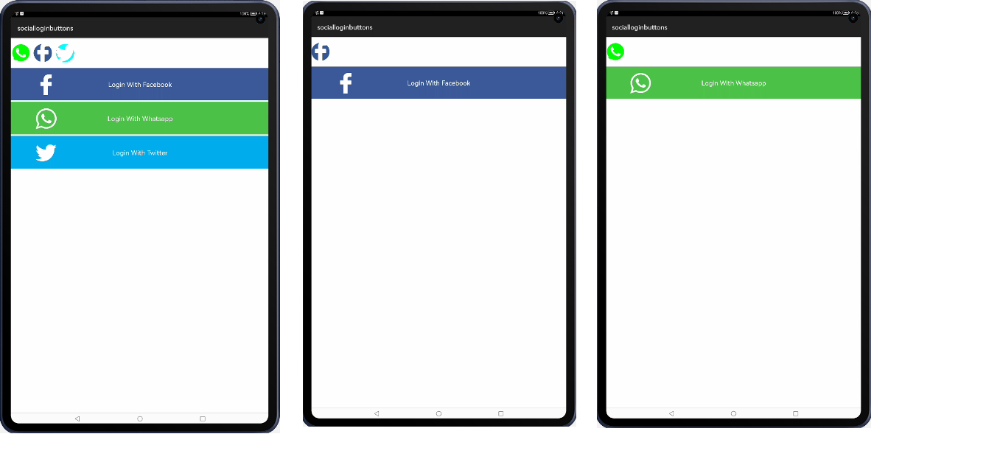

HMOS SocialButtons
=================
[](https://github.com/applibgroup/HMOS-SocialButtons/actions/workflows/main.yml)
[](https://sonarcloud.io/dashboard?id=applibgroup_HMOS-SocialButtons)

Introduction
------------
An HMOS library for implementing login/share buttons easily for social networks.

As of now, this is **only** a UI library. This library does not provide any social network
functionality. That you have to code yourself.

# Source

The code in this repository was inspired from [championswimmer/Android-SocialButtons - v1.1](https://github.com/championswimmer/Android-SocialButtons). We are very thankful to championswimmer.

Screenshot
----------


## How to use

## Installation
In order to use the library, add the following line to your **root** gradle file:

I) For using SocialButton module in sample app, include the source code and add the below dependencies in entry/build.gradle to generate hap/support.har.
```
dependencies {
            implementation project(':socialbuttons')
            implementation fileTree(dir: 'libs', include: ['*.jar', '*.har'])
            testImplementation 'junit:junit:4.13'
            ohosTestImplementation 'com.huawei.ohos.testkit:runner:1.0.0.100'
}
```
II) For using SocialButton in separate application using har file, add the har file in the entry/libs folder and add the dependencies in entry/build.gradle file.
```
dependencies {
        implementation fileTree(dir: 'libs', include: ['*.har'])
        testImplementation 'junit:junit:4.12'
}
```
III) For using SocialButton from a remote repository in separate application, add the below dependencies in entry/build.gradle file.
```
dependencies {
        implementation 'dev.applibgroup:socialbuttons:1.0.0'
        testImplementation 'junit:junit:4.13'
        ohosTestImplementation 'com.huawei.ohos.testkit:runner:1.0.0.100'
}
```

### Floating Action Buttons
#### Usage
To use FloatingActionButtons, (for example a Facebook button), use the `FABFacebook` component

```xml
        <in.championswimmer.libsocialbuttons.SocialFab
                            ohos:height="match_content"
                            ohos:width="match_content"
                            ohos:fab_elevation="4vp"
                            ohos:fab_colorNormal="#345896"
                            ohos:image_src="$media:logo_facebook"/>

```

#### Customizations
xml attributes need to set from xml are the following:
`ohos:fab_elevation="4vp"`,
`ohos:fab_colorNormal="#345896"`
`ohos:image_src="$media:logo_facebook"`
 or else will have no effect of FAB. 

### SocialButton
#### Usage
For example a Twitter button, use the following in your xml   
```xml
    <in.championswimmer.libsocialbuttons.SocialButton
                ohos:id="$+id:btn_twitter"
                ohos:height="match_content"
                ohos:width="match_parent"
                ohos:text="$string:login_twitter"
                ohos:text_size="20vp"
                app:msb_social="$string:twitter"/>
```

#### Customizations
You have to set your own text using the `ohos:text="$string:login_twitter"` attribute. Where `login_twitter` has value `Login with twitter`.
You have to set `app:msb_social="$string:twitter"` in order set background color for twitter and twitter icon 


### Credits 
* [DesignPieces collection of social colors](http://designpieces.com/2012/12/social-media-colours-hex-and-rgb/)

Support and extension
---------------------

Currently there is a limitation to

i) set image source and background color from library end. So, app developer has to set through xml for SocialFab as shown below:
`ohos:fab_colorNormal="#345896"`
`ohos:image_src="$media:logo_facebook"`

ii) and library dependency is there to set height and width for SocialFab


## License 
This software is licensed under the Apache License V2.0
A copy can be found [here](./LICENSE.md)
